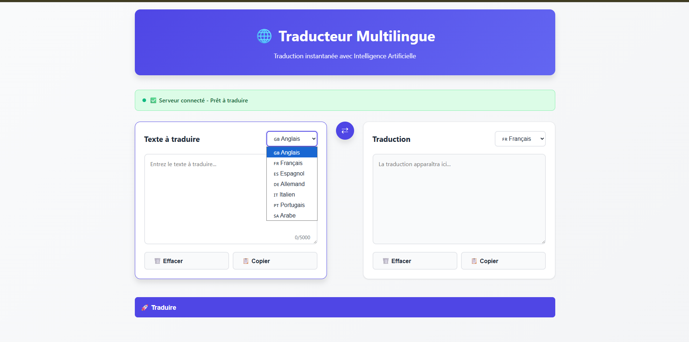
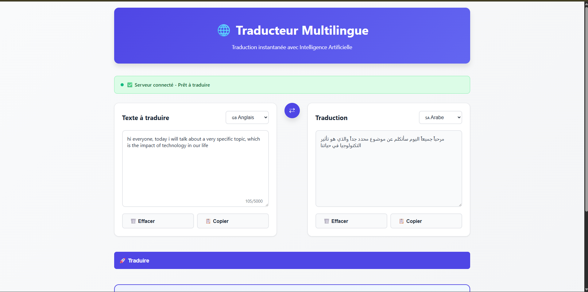
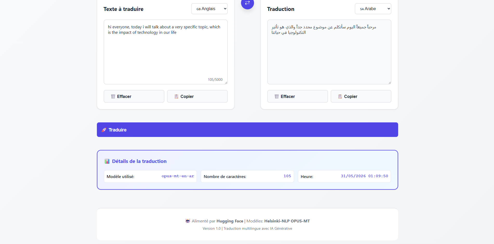

# 🌐 Traducteur Multilingue — Traduction Automatique par IA

Application web permettant de **traduire du texte entre plusieurs langues en temps réel** grâce à l'intelligence artificielle (Helsinki-NLP OPUS-MT via Hugging Face).

## Étudiants

- Soufia Bahrini // soufia.bahrini@enstab.ucar.tn  **2EAN**

## 🚀 Démo en Ligne
 
- 🌐 **Interface Web** : [https://sofia123-crypto.github.io/traducteur-multilingue/](https://sofia123-crypto.github.io/traducteur-multilingue/)


## 📸 Captures d'Écran

### Image 1 - Interface Principale


### Image 2 - Exemple de Traduction


### Image 3 - Statistiques de Traduction


## 🎬 Vidéo Démo


📽️ [Regarder la démo sur Google Drive](https://drive.google.com/drive/folders/1ECspIKN9h0NG9cr6t7CvujXZWiH08TVD?usp=sharing)

## Architecture du Projet

```
traducteur-multilingue/
├── backend/
│   ├── server.js             # Serveur Express.js (backend API)
│   ├── package.json          # Dépendances Node.js
│   ├── .env.example          # Template de configuration
│   └── .gitignore            # Fichiers à ignorer
├── frontend/
│   ├── index.html            # Interface principale
│   ├── styles.css            # Styles CSS (design moderne)
│   └── script.js             # Logique front-end
├── docs/                     # Documentation & captures d'écran
├── README.md
└── .gitignore
```

## Technologies Utilisées

| Composant | Technologie |
|-----------|-------------|
| **Backend** | Node.js + Express.js |
| **Modèle IA** | Helsinki-NLP OPUS-MT (via Hugging Face Inference API) |
| **Frontend** | HTML5, CSS3, JavaScript (Vanilla) |
| **Hébergement Backend** | Render.com |
| **Hébergement Frontend** | GitHub Pages |
| **Design** | Design moderne responsive avec gradients |

## Installation et Lancement

### Pré-requis

- **Node.js 14+** installé sur votre machine
- Un **token Hugging Face** (gratuit)

### Étape 1 : Obtenir un Token Hugging Face

1. Allez sur [https://huggingface.co/join](https://huggingface.co/join) et créez un compte (gratuit)
2. Allez sur [https://huggingface.co/settings/tokens](https://huggingface.co/settings/tokens)
3. Cliquez sur **"New token"**
4. Donnez un nom au token (ex: `traducteur`)
5. Sélectionnez le type **"Read"**
6. Cliquez sur **"Generate"** et copiez le token

### Étape 2 : Installer les Dépendances

```bash
# Cloner le projet
git clone https://github.com/VOTRE_NOM/traducteur-multilingue.git
cd traducteur-multilingue

# Installer les dépendances backend
cd backend
npm install
```

### Étape 3 : Configurer le Token

Créez le fichier `.env` à partir du template :

```bash
# Windows (PowerShell)
copy .env.example .env

# Linux / macOS
cp .env.example .env
```

Ouvrez le fichier `backend/.env` et remplacez la clé API par votre token :

```env
HF_API_KEY=hf_votre_token_ici
PORT=5000
CORS_ORIGIN=http://localhost:3000
```

**⚠️ NE PAS COMMIT ce fichier — il est déjà dans `.gitignore`**

### Étape 4 : Lancer l'Application

```bash
# Démarrer le backend (depuis le dossier backend)
npm start
```

Ouvrez votre navigateur à l'adresse : **[http://localhost:5000](http://localhost:5000)**

## Fonctionnalités

- Traduction de texte entre 7+ langues (Anglais, Français, Espagnol, Allemand, Italien, Portugais, Arabe)
- Échange de langues source/cible en un clic (⇄)
- Copie facile des textes (source et traduction)
- Compteur de caractères avec limite de 5000 caractères
- Statistiques en temps réel (modèle utilisé, nombre de caractères, horodatage)
- Barre de statut de connexion serveur
- Interface responsive (mobile et desktop)
- Raccourci clavier `Ctrl+Entrée` pour traduire

## Modèle IA Utilisé

**Helsinki-NLP OPUS-MT** (`Helsinki-NLP/opus-mt-[lang-pair]`)

- Type : Modèle **Transformer** (Neural Machine Translation)
- Architecture : Encoder-Decoder séquence vers séquence
- Support : 12+ paires de langues directes + modèle multilingue de fallback
- Accès : Via l'API d'inférence Hugging Face (gratuit)


